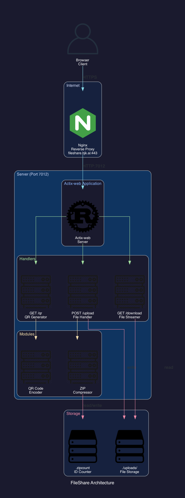

# FileShare

A minimal, fast file sharing web application built with Rust and Actix-web. Upload files, get a shareable link and QR code instantly.



## Features

- **Drag & Drop** - Drop files directly onto the page or click to browse
- **Multiple Files** - Upload multiple files at once, automatically bundled into a ZIP
- **Custom Names** - Optionally rename your upload
- **QR Codes** - Server-generated QR codes for easy mobile sharing
- **Clean URLs** - Simple `https://domain.com/filename.ext` links
- **Dark Theme** - Modern, minimal dark UI
- **Fast** - Built with Rust for minimal resource usage (~20MB RAM)

## Quick Start

```bash
# Clone
git clone https://github.com/adminbjkai/fileshare.git
cd fileshare

# Build and run
cargo build --release
./target/release/fileshare

# Visit http://localhost:7012
```

## Configuration

Environment variables:

| Variable | Default | Description |
|----------|---------|-------------|
| `FILESHARE_HOST` | `0.0.0.0` | Bind address |
| `FILESHARE_PORT` | `7012` | Server port |
| `FILESHARE_BASE_URL` | `http://localhost:7012` | Public URL for generated links |

## Deployment

See [docs/DEPLOY.md](docs/DEPLOY.md) for full deployment guide including:
- systemd service setup
- Nginx reverse proxy config
- SSL with Let's Encrypt

### Quick Deploy

```bash
# Copy to server
scp -r . user@server:/opt/fileshare/

# On server
cargo build --release
cp docs/fileshare.service /etc/systemd/system/
systemctl enable --now fileshare
```

## Tech Stack

- **Backend**: Rust + Actix-web
- **QR Generation**: `qrcode` + `image` crates
- **ZIP**: `zip` crate with deflate compression
- **Frontend**: Vanilla HTML/CSS/JS (no frameworks)

## File Naming

| Upload Type | Custom Name | Result |
|-------------|-------------|--------|
| Single file | Not set | `original-name.ext` |
| Single file | Set | `custom-name.ext` |
| Multiple files | Not set | `zipfile_1.zip`, `zipfile_2.zip`... |
| Multiple files | Set | `custom-name.zip` |

## API

| Method | Endpoint | Description |
|--------|----------|-------------|
| `GET` | `/` | Web UI |
| `POST` | `/upload` | Upload files (multipart/form-data) |
| `GET` | `/{filename}` | Download file |
| `GET` | `/qr/{filename}` | Get QR code PNG |

## License

MIT
